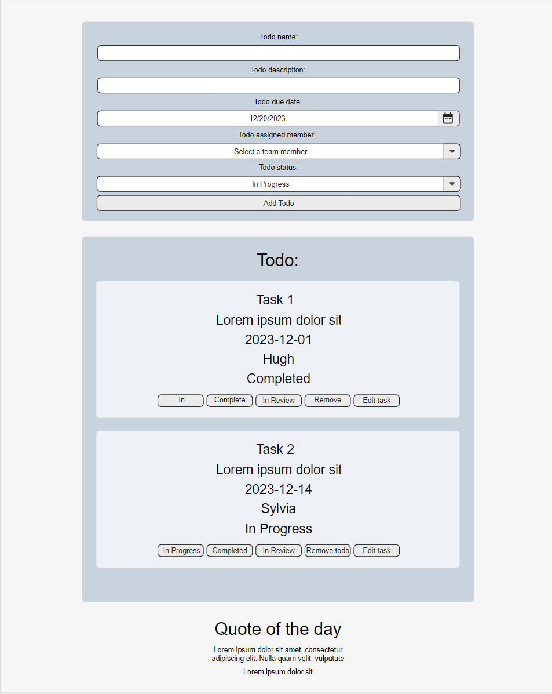

# React ToDo Application

[](https://github.com/Hughsin23/generation-team-todo/stargazers)
[](https://github.com/Hughsin23/generation-team-todo/network)
[](https://github.com/Hughsin23/generation-team-todo/issues)
[](https://github.com/Hughsin23/generation-team-todo/graphs/contributors)

## Description

Welcome to our React ToDo application! This project is a collaborative effort to create a reactive and user-friendly ToDo application using React. The goal is to provide users with a seamless experience for managing tasks, including the ability to edit, sort, and remove tasks from the to-do list.

## Live page

You can find our deployment of the project [Here](https://hughsin23.github.io/generation-team-todo/).

## Table of Contents

* [Wireframe](#wireframe)
* [Installation](#installation)
* [Usage](#usage)
* [Contributors](#contributors)

## Technology Used


## Wireframe



## Installation

To get started with our ToDo application, follow these steps:

1. Clone the repository:
   ```sh
   git clone https://github.com/Hughsin23/generation-team-todo.git
   ```
2. Navigate to the project directory:
    ```sh
    cd generation-team-todo
    ```
3. Install dependencies:
    ```sh
    npm install
    ```
4. Start the development server:
    ```sh
    npm start
    ```
Now you're all set up to use our ToDo application locally!

## Usage

Our ToDo application allows you to manage tasks efficiently. Here's how you can use it:

### Add a new task:

* Fill in the required details, including ToDo name, ToDo description, ToDo due date, ToDo assigned member, and ToDo status.
* Click "Add ToDo" button to add the task to your to-do list.

### Edit a task:

* For quick status updates, click "In progress", "Completed" or "In Review" button to update the task.
* To modify the task details in a form, click "Edit task" button.
* Click "Edit ToDo" button to save the task.

### Remove a task:

* Click "Remove todo" button to delete the task.

### Sort tasks:

* Use the sorting options to arrange tasks by status.

## Main issues
* Getting the local storage working was annoying, as I (Hugh) forgot that strictmode for Dev will run useEffect twice, and thus was wiping my storage, massive shoutout to Liam and Tracey for helping me remember that.
* Getting the edit button to update the tasks, took a few iterations. I think the one implemented isn't the best, but it's working for now. I'd like to go back and get it to render the form back in a modal for creation and editing.

## Future changes
* Have the create task and edit task bring up our form in a modal, rather than having it render on the main page.
* Have each ToDo take up the size of a post-it, rather than an entire column across the page. Grid or flexbox will probably be the solution here
* Improve input box layout, looking less like a series of input boxes, more pleasant inputs.  

## Contributors

__Hugh Sinclair__
[GitHub](https://github.com/Hughsin23 "Hugh's GitHub") / [LinkedIn](https://www.linkedin.com/in/hugh-sinclair-dev/ "Hugh's LinkedIn") / [Email](<hughsin23@gmail.com>)

__Praseen Shamakura__
[GitHub](https://github.com/PraseenS "Praseen's GitHub") / [Email](<spraseen@gmail.com>)

__Shihua (Sylvia) XIE__
[GitHub](https://github.com/shihuaxie "Shihua's GitHub") / [LinkedIn](https://www.linkedin.com/in/shihua-sylvia-xie-136282197/ "Shihua's LinkedIn") / [Email](<sylvia501628@gmail.com>)

__Tracey Ngo__
[GitHub](https://github.com/NTracey "Tracey's GitHub") / [LinkedIn](https://www.linkedin.com/in/tracey-ngo/ "Tracey's LinkedIn") / [Email](<traceyngo4@gmail.com>)

__Liam Allen__
[Email](<liamleeallen1998@hotmail.com>)

#### Our instructor/mentor - __Elias Matta__ [Email](<elias.matta@generation.org>)
